# O que o tio Lex (acha que) entende de GIT

### Menuzinho xavoso
- [Um pouco sobre git, github e afins](#UmPoucoSobreGit)
- [Ajudando a simplificar o trabalho](#AjudandoSimplificar)
- [Criando uma nova branch a partir de develop](#CriandoUmaBranch)
- [Adicionando alterações em stage e fazendo o commit](#stageECommit)
- [Corrigindo mensagem do commit](#CorrigirCommit)
- [Fazendo um squash dos commits](#SquashCommits)
  - [Squash utilizando o reset soft](#SquashResetSoft)
  - [Squash utilizando o rebase -i](#SquashRebaseI)
- [Publicando a branch](#publish)
- [Finalizando a branch/mergeando em develop](#finish)
- [Remover alterações de stage](#removendoStage)
- [Outros fluxos do git flow](#OutrosGitFlow)
- [Considerações finais](#TheEnd)
- [Dicionário de termos](#dicionario)

### Um pouco sobre git, github e afins<a id="UmPoucoSobreGit"></a>

O git é um excelente sistema de controle de versão (se não acredita, tente usar o SVN ou até mesmo o CVS, que foi quem deu origem ao git devido o ódio que o Torvalds sentiu dele e isso [motivou a criação do git](https://www.youtube.com/watch?v=4XpnKHJAok8&ab_channel=Google) rsrsrsrs).

Utilizamos o git para controlar versões diferentes de código, tendo um histórico de suas alterações e diminuindo o risco de perder partes do código devido uma alteração incorreta que fizemos sem perceber.

Se você já fez algum trabalho em grupo tanto acadêmico quanto profissionalmente, em que você tem arquivos do office por exemplo, é muito provável que existiram cópias dos arquivos, como por exemplo "documento_1.doc" ou "documento_versão_do_fulano.doc", isso em desenvolvimento de código também ocorria antigamente, mas são épocas passadas. Se você ainda desenvolve assim, ou você ainda não foi apresentado ao git ou você precisa ser estudado.

É extremamente comum desenvolvedores de todos os níveis postarem links de seus repositórios do Github ou Gitlab (nunca vejo ninguém comentar nem a existência do bitbucket) em suas redes sociais. Esses sites são na verdade repositórios onde boa parte dos devs guardam uma cópia do seu código, mesmo você podendo [hospedar em um HD ou até mesmo alguns serviços de nuvem](https://www.iexplain.org/using-git-with-google-drive-a-tutorial/) com acesso mais restrito para outras pessoas. Sim, eu sei que tanto o github quanto o gitlab permitem criar repositórios privados, mas até quando eles estarão disponíveis para você? [Os termos do github nos dizem que isso é um mistério, sabia](https://docs.github.com/pt/github/site-policy/github-terms-of-service#3-github-may-terminate)? É, a gente não costuma ler os contratos (me incluo fortemente nessa parte), e podemos ser surpreendidos um dia.

Então só quero deixar claro que você não precisa de um repositório online para versionar seu código e também não precisa enviar uma cópia para lugar nenhum, você pode ter (por sua conta e risco) seu código apenas no seu HD e mesmo assim ter os benefícios da utilização do git.


### Ajudando a simplificar o trabalho<a id="AjudandoSimplificar"></a>

Boa parte de criação de branchs e gerenciamento delas, vou me referir utilizando o git flow, porque eu sinceramente não sei usar o git sem o uso do git flow.
Minha vivência com git desde o início da minha carreira de dev, sempre foi utilizando essa ideia de fluxo de trabalho descrita em um artigo do [Vincent Driessen em Janeiro de 2010](https://nvie.com/posts/a-successful-git-branching-model/), que uso como base mas que sinceramente aprendi pelo [cheatsheet do Daniel Kummer](https://danielkummer.github.io/git-flow-cheatsheet/index.pt_BR.html).

Confere lá tanto o cheatsheet quanto o artigo para ver como o git flow pode te ajudar.


### Criando uma nova branch a partir de develop<a id="CriandoUmaBranch"></a>

Você recebeu a tarefa de criar uma nova funcionalidade para uma determinada classe, por isso vai iniciar sua branch com base em develop, utilizando o comando:

```
git flow feature start nome-da-branch
```

Exemplo:

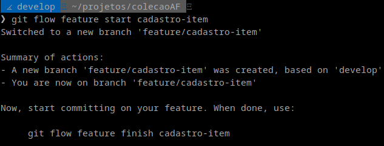

<sub><sup>Imagem 01 - Iniciando uma branch</sup></sub>

### Adicionando alterações em stage e fazendo o commit<a id="stageECommit"></a>
Agora basta fazer as alterações necessárias e adicionar os arquivos alterados no [stage](#stage) para em seguida fazer o [commit](#commit) deles, com os comandos:

```
git add nome-do-arquivo
git commit -m "mensagem do commit"
```

Exemplo:

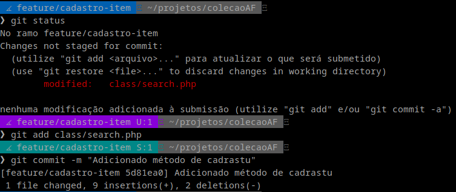

<sub><sup>Imagem 02 - Fazendo o commit</sup></sub>

### Corrigindo mensagem do commit<a id="CorrigirCommit"></a>
Você notou que cometeu um erro na mensagem, e agora? Deixa assim e tá tudo certo, não é mesmo? NÃO! Corrija isso, pelo amor hein.

```
git commit -m "mensagem correta do commit" --amend
```

Exemplo:

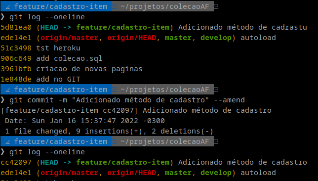

<sub><sup>Imagem 03 - Corrigindo a mensagem do commit com amend</sup></sub>

Note que ao fazer isso, o hash de identificação do commit mudará, isso poderá causar problema para outras pessoas que já tenham esse commit em seu repositório local, então evite fazer esse tipo de alteração em branchs como master e develop que geralmente são as branchs principais de um projeto.

### Fazendo um squash dos commits<a id="SquashCommits"></a>
Uma prática muito boa, é fazer um [squash](#squash) dos commits da sua branch, antes de mandar todas as suas alterações para develop.

Eu conheço duas formas de fazer o squash, então vou exemplificar cada uma delas.

Em ambos os casos, precisamos verificar quais os commits vamos unificar. No exemplo, faremos isso com todos os 4 commits feitos na nova branch.

Uma das formas de saber qual foi seu primeiro commit nessa nova branch, é verificar utilizando o log do git, qual o commit está na branch de origem, que no caso, é develop.

```
git log --oneline
```

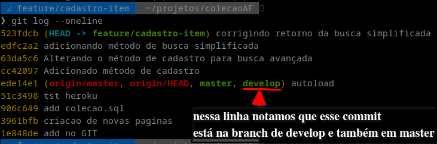

<sub><sup>Imagem 04 - Vendo os logs de commits</sup></sub>

#### Squash utilizando o reset soft<a id="SquashResetSoft"></a>
Vamos então, fazer o [squash](#squash) utilizando o reset soft.

```
git reset --soft HASH-DO-COMMIT-ANTERIOR-AO-NOSSO-PRIMEIRO-COMMIT
```

Exemplo: 

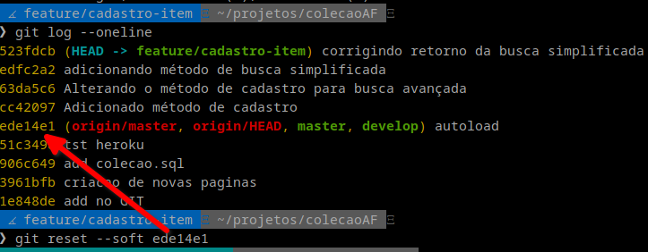

<sub><sup>Imagem 05 - git reset --soft</sup></sub>

Após o reset soft, todas as alterações feitas nos 4 commits da nossa branch, estarão em stage, prontas para um novo commit, e todos os commits não estarão mais em nosso log.

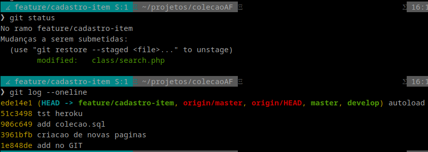

<sub><sup>Imagem 06 - git rebase -i</sup></sub>

Basta então fazer o commit com a mensagem que melhor descreve o que foi feito no código.
#### Squash utilizando o rebase -i<a id="SquashRebaseI"></a>
Vamos então, fazer o [squash](#squash) utilizando o rebase.

```
git rebase -i HEAD~4
```

Isso fará com que o novo head da branch seja um commit com os 4 últimos commits juntos.

O comando nos leva para uma arquivo dentro do nosso editor padrão, onde são exibidos os commits que serão unificados.

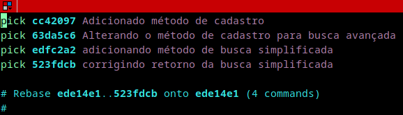

<sub><sup>Imagem 07 - Arquivo de seleção de commits para o squash</sup></sub>

Marcamos como 'pick' o commit que será usado e marcamos como 'squash' os commits que serão "mesclados".

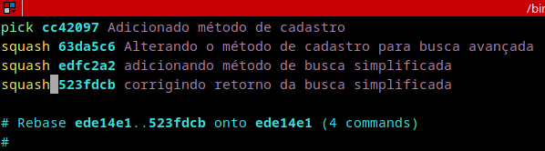

<sub><sup>Imagem 08 - Alterando os commits que irão apra squash</sup></sub>

Após salvar as alterações, um novo arquivo será apresentado, onde colocaremos a mensagem do novo commit. 

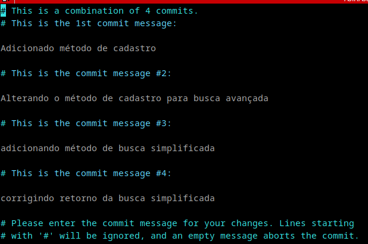

<sub><sup>Imagem 09 - Exibindo a mensagem do novo commit</sup></sub>

Podemos apagar todos os comentários (é o que costumo fazer) e adicionar a nova mensagem.

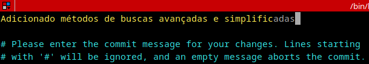

<sub><sup>Imagem 10 - Alterando a mensagem do novo commit</sup></sub>

O resultado de tudo isso, é um commit com todas as alterações unificadas.

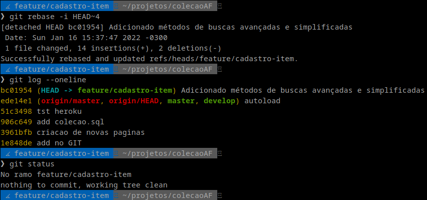

<sub><sup>Imagem 11 - Resultado do rebase</sup></sub>

### Publicando a branch<a id="publish"></a>
Com tudo pronto, em um fluxo saudável de desenvolvimento, publicamos a branch para um code review ou testes, então os comandos seriam:

```
git flow feature publish nome-da-branch
```

Exemplo:

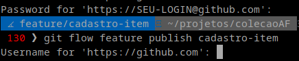

<sub><sup>Imagem 12 - git flow feature publish</sup></sub>

### Finalizando a branch/mergeando em develop<a id="finish"></a>
Finalizado os testes/reviews e as alterações feitas na branch sendo aprovadas, é hora de finalizar a branch.

```
git flow feature finish nome-da-branch
```

Exemplo:

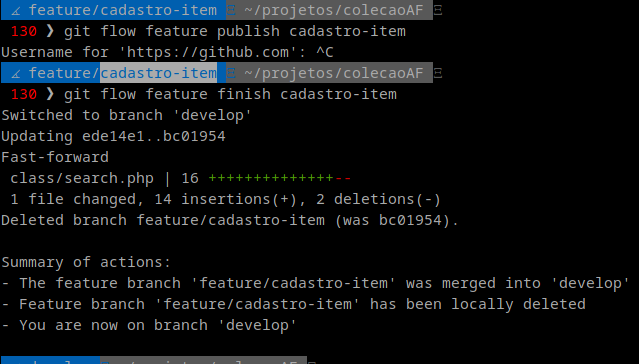

<sub><sup>Imagem 13 - git flow feature finish</sup></sub>

Sempre que uma branch do tipo feature (lembre de ver mais detalhes no [cheatsheet](#AjudandoSimplificar) mencionada lá no começo do artigo) for finalizada, seus commits são enviadas para develop, agora é só dar push de tudo.

```
git push origin develop
```

Exemplo:

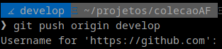

<sub><sup>Imagem 14 - push de develop</sup></sub>

### Remover alterações de stage<a id="removendoStage"></a>
Uma vez ou outra, acabamos adicionando um arquivo novo sem necessidade, ou alterando arquivos que não eram para ter sido alterados, mas por falta de atenção, acabamos adicionando tudo no stage (para de usar o "git add ." caramba!), e nada melhor do que um simples reset -- do arquivo alterado erroneamente.

```
git reset -- nome-do-arquivo
```

Exemplo:

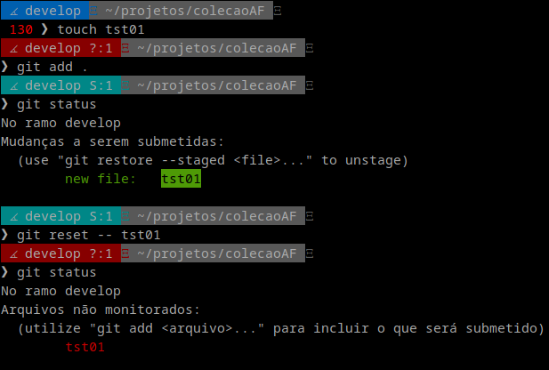

<sub><sup>Imagem 15 - Retirando alterações do stage</sup></sub>

SIM, é um hífen duas vezes, seguido por um espaço em branco, só depois adiciona-se o nome do arquivo.

Colocando o nome do arquivo, ele sairá do stage, se não inserir nome do arquivo após os dois hifens, todos os arquivos que estão prontos para serem comitados, irão sair do stage.

### Outros fluxos do git flow<a id="OutrosGitFlow"></a>
Não vou focar em outras partes do git flow tão detalhadamente (acredite, o flow merece mais atenção, então novamente, olhe o cheatsheet), então vamos para um resumo de outros comandos que utilizo com certa frequência, incluindo o fluxo deles.

  - #### Fluxo de um release
    Ocorre quando tudo que fizemos em develop, precisa ser enviado para a branch principal.
    - ###### git flow release start v1.0.0
      Inicia uma nova branch com base em develop e cria a tag de versão.

      O v1.0.0, é a tag que identificará a versão da release. Leia sobre o [versionamento semântico](https://semver.org/lang/pt-BR/).
    - ###### git add nome-do-arquivo e git commit -m "mensagem do commit"
      Adicionamos os arquivos no stage e adicionamos a mensagem do commit.
    - ###### git flow release finish v1.0.0
      Finaliza a branch de release e todos os commits que estavam em develop, vão para 3 branchs que são:
        - develop
        - v1.0.0 `(tag criada com a versão 1.0.0 do projeto)`
        - master
  - #### Fluxo de um hotfix
    Ocorre quando descobrimos que existe um problema em produção/branch principal que não pode aguardar para ser corrigido.
    - ###### git flow hotfix start v1.0.1
      Inicia uma branch com base em master/branch de produção.
    - ###### git add nome-do-arquivo e git commit -m "mensagem do commit"
      Após corrigir o que for necessário, adicione o arquivo com o `git add` e faça o commit com `git commit -m`
    - ###### git flow hotfix finish v1.0.1
      Finaliza a branch hotfix e todos os commits do hotfix serão enviados para:
        - develop
        - v1.0.1
        - master
  


## Considerações finais<a id="TheEnd"></a>

A idéia do artigo era guardar para meu próprio uso e consultas futuras (caso precise), e compartilhar com algumas pessoas próximas que usam o git, porém, acredito que o resultado ficou até que legal (levando em consideração quem escreveu hahahaha), então decidi compartilhar.

O artigo do [Vincent Driessen em Janeiro de 2010](https://nvie.com/posts/a-successful-git-branching-model/), já tem uma `nota de reflexão` de março de 2020, sugerindo o uso do [GitHub flow](https://docs.github.com/pt/get-started/quickstart/github-flow), mas no meu uso atual, o git-flow ainda me atende MUITO bem, analise o que é melhor para você e sua equipe, não procure a resposta pronta, o que é melhor para você e sua equipe pode ser diferente do que funciona para a minha equipe ou para a equipe do seu amiguinho dev.

Obs.: Este artigo foi revisado pela `mesma pessoa que escreveu, porém com sono`. Tudo escrito aqui foi baseado na MINHA EXPERIÊNCIA como dev pleno de 2 anos (huehuebr), não leve possíveis erros para o coração, envie sugestão que podemos fazer um hotfix do artigo :-)

## Dicionário de termos<a id="dicionario"></a>

- ### Stage<a id="stage"></a>
    É a área onde ficam as alterações que estão prontas para o commit
- ### Commit<a id="commit"></a>
    É o ponto onde tornamos "permanentes" um conjunto de alterações, como se estivesse salvando um documento do word com um nome para consulta futura daquelas alterações.
- ### Squash<a id="squash"></a>
    É quando você junta diversos commits em um único novo commit para que o log do git fique mais organizado e mais simples de entender ou de voltar em um conjunto de alterações específica.
- ### Reset<a id="reset"></a>
    É quando voltamos a branch para um estado especifico
  - #### git reset --soft
    É a opção onde tudo que foi alterado permanece em stage pronto para ser comitado, desconsiderando apenas os commits em si.
  - #### git reset --hard
    É a opção onde tudo que foi alterado é ignorado/jogado fora.
- ### HEAD
  É a última versão de uma branch, o último commit, o mais recente, the major rsrsrsrs