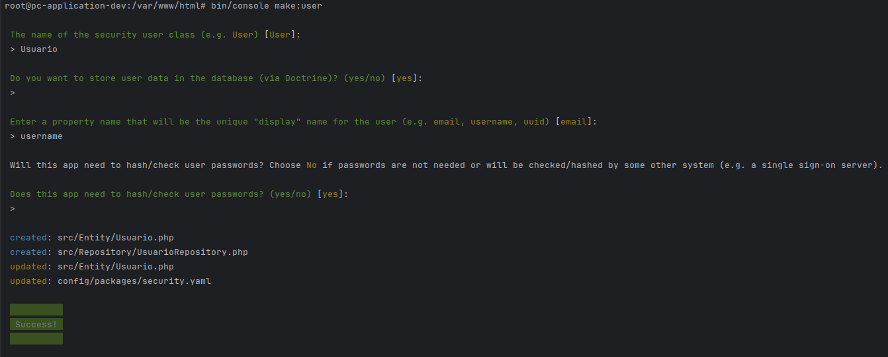
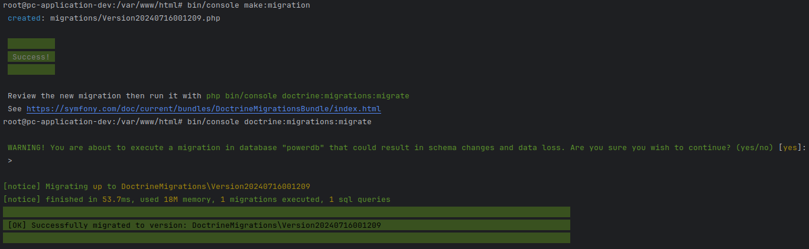
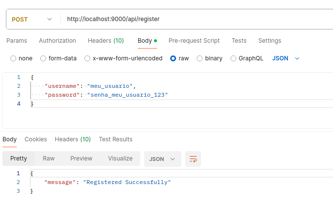
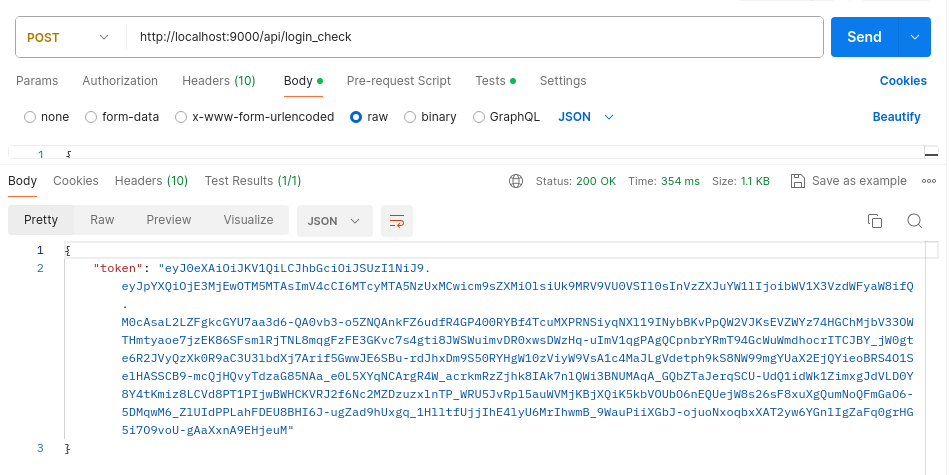
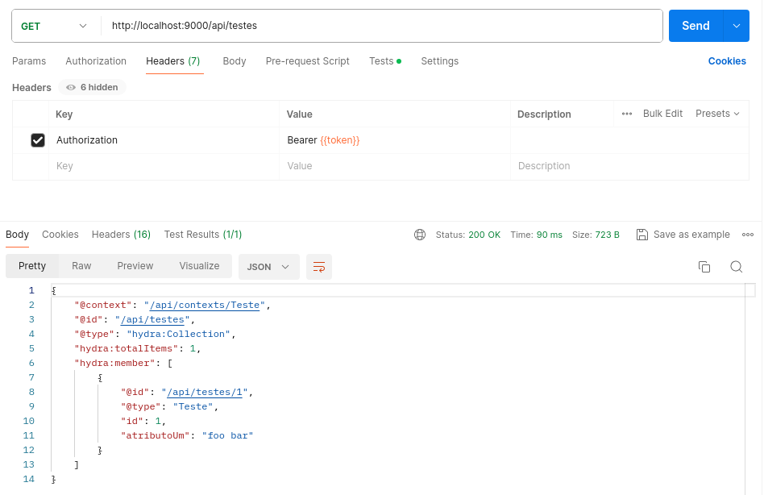
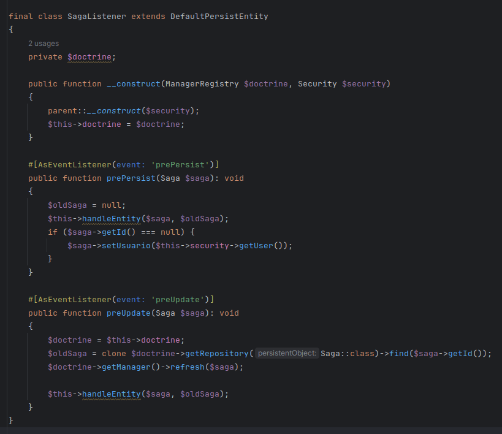
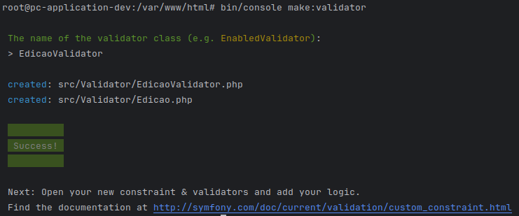

# Power Comics API

## O que abordaremos?
Com o intuito de apenas passar por alguns passos importantes e que podem ajudar outras pessoas a iniciarem o desenvolvimento de suas aplicações symfony, vamos documentar apenas ALGUNS passos, não todo o projeto em si.

Outro ponto que é bom deixar claro, é que algumas coisas que foram desenvolvidas/configuradas no inicio, podem e provavelmente serão alteradas com o decorrer do desenvolvimento, e por este motivo, mais a frente pode-se encontrar correções ou complementos de algo que já havia sido feito/mencionado, então (quando eu lembrar de fazer) colocarei a identificação **< UPDATE >** no titulo ou parte do texto (qqc, faz um find aí...).

## Ambiente
Antes de mais nada, famos instalar o 'básico':
1. Instalação do Symfony
```
composer create-project symfony/skeleton:"6.4.*" my_project_directory
```
2. Instalação do API Platform
```
composer require api
```

## Autênticação JWT
Tá aí uma coisa um pouco mais "complicada" e que levou mais tempo do que eu esperava para realizar todos os passos. Então vamos a eles:
1. Para autênticar, é necessário alguma forma de validar usuário e senha, então usaremos o armazenamento do usuário através do banco de dados, então para usar o 'make' do symfony, vamos instalar o seu bundle.
```
composer require symfony/maker-bundle --dev
```
2. Agora vamos usar o make para criar o usuário, definindo qual atributo será usado como unico, como email ou nome de usuário.



3. Vamos então criar a tabela no banco de dados, usando a criação do migration e executando-a em seguida.



4. Hora de instalar o pacote responsável pelo uso do JWT
```
composer require lexik/jwt-authentication-bundle
```

5. Este script em Shell é utilizado para configurar um ambiente de autenticação JWT (JSON Web Token) em um sistema baseado em Linux. Ele gera chaves privadas e públicas para JWT e define permissões de acesso.
```
mkdir -p config/jwt
jwt_passphrase=${JWT_PASSPHRASE:-$(grep ''^JWT_PASSPHRASE='' .env | cut -f 2 -d ''='')}
echo "$jwt_passphrase" | openssl genpkey -out config/jwt/private.pem -pass stdin -aes256 -algorithm rsa -pkeyopt rsa_keygen_bits:4096
echo "$jwt_passphrase" | openssl pkey -in config/jwt/private.pem -passin stdin -out config/jwt/public.pem -pubout
setfacl -R -m u:www-data:rX -m u:"$(whoami)":rwX config/jwt
setfacl -dR -m u:www-data:rX -m u:"$(whoami)":rwX config/jwt
```

6. Defina a rota que utilizaremos para validar o login em 'application/config/routes.yaml' adicionando:
```yaml
api_login_check:
    path: /api/login_check
```

7. Agora vamos definir as regras de segurança em 'application/config/packages/security.yaml'
- Adicionado em firewalls o item 'docs' para acesso a documentação da API sem necessidade de login (security: false).
```yaml
firewalls:
    docs:
        pattern: ^/api/docs
        security: false
```
- Sobrescrevendo o item main
   - Definindo o stateless como true para que não manter o estado da sessão entre requisições.
   - Configurando o login por JSON em json_login.
      - check_path: Define o endpoint onde as credenciais de login devem ser enviadas para autenticação.
      - success_handler: Define o manipulador que lida com autenticação bem-sucedida. lexik_jwt_authentication.handler.authentication_success é um serviço que gera e retorna um token JWT.
      - failure_handler: Define o manipulador que lida com falhas de autenticação. lexik_jwt_authentication.handler.authentication_failure é um serviço que retorna uma resposta apropriada em caso de falha de login.
      - jwt: Configura o firewall para usar autenticação JWT. O ~ indica que as configurações padrão do JWT são usadas.
```yaml
main:
    pattern: ^/api
    stateless: true
    json_login:
      check_path: /api/login_check
      success_handler: lexik_jwt_authentication.handler.authentication_success
      failure_handler: lexik_jwt_authentication.handler.authentication_failure
    jwt: ~
```
- Por último, inserir no access_control, os papéis/permissões necessárias para acessar determinadas URLs.
   - IS_AUTHENTICATED_ANONYMOUSLY: Permite acesso a qualquer usuário, mesmo que não esteja autenticado. Necessário para que usuários possam realizar login, acessar a doc e também o endpoint de registro de usuário.
   - IS_AUTHENTICATED_FULLY: Exige que o usuário esteja totalmente autenticado para acessar essas rotas. Isso significa que o usuário deve ter feito login e ter um token de autenticação válido.
   - PUBLIC_ACCESS: É uma constante que permite acesso público a essa rota, significando que qualquer usuário, mesmo que não esteja autenticado, pode acessar essa rota. É semelhante a IS_AUTHENTICATED_ANONYMOUSLY, mas mais explícito no sentido de que não há qualquer requisito de autenticação.
```yaml
access_control:
  - { path: ^/api/register, roles: PUBLIC_ACCESS }
  - { path: ^/api/docs, roles: IS_AUTHENTICATED_ANONYMOUSLY }
  - { path: ^/api/login_check, roles: IS_AUTHENTICATED_ANONYMOUSLY }
  - { path: ^/, roles: IS_AUTHENTICATED_FULLY }
```
8. Vamos criar a controller de registro de usuário para que este usuário possa posteriormente ser autênticado.
- Criando a controller:
```
bin/console make:controller RegistrationController
```
- Definindo o conteúdo:
```php
#[Route('/api', name: 'api_')]
class RegistrationController extends AbstractController
{
    #[Route('/register', name: 'register', methods: 'post')]
    public function index(ManagerRegistry $doctrine, Request $request, UserPasswordHasherInterface $passwordHasher): JsonResponse
    {
        $em = $doctrine->getManager();
        $decoded = json_decode($request->getContent());
        $plaintextPassword = $decoded->password;

        $user = new Usuario();
        $hashedPassword = $passwordHasher->hashPassword(
            $user,
            $plaintextPassword
        );
        $user
            ->setPassword($hashedPassword)
            ->setUsername($decoded->username)
            ->setRoles(['ROLE_USER'])
        ;
        $em->persist($user);
        $em->flush();

        return $this->json(['message' => 'Registered Successfully']);
    }
}
```
Obs.: Usamos o 'UserPasswordHasherInterface' para fazer o encoding da senha enviada.
9. Testando a autênticação:

- Cadastro de um usuário:



- Obtendo token do usuário cadastrado:



- Obtendo dados utilizando token na requisição:



## Todos comandos mencionados até o momento:
```
composer create-project symfony/skeleton:"6.4.*" my_project_directory
composer require api
composer require symfony/maker-bundle --dev
bin/console make:user
bin/console make:migration
bin/console doctrine:migrations:migrate
composer require lexik/jwt-authentication-bundle
mkdir -p config/jwt
jwt_passphrase=${JWT_PASSPHRASE:-$(grep ''^JWT_PASSPHRASE='' .env | cut -f 2 -d ''='')}
echo "$jwt_passphrase" | openssl genpkey -out config/jwt/private.pem -pass stdin -aes256 -algorithm rsa -pkeyopt rsa_keygen_bits:4096
echo "$jwt_passphrase" | openssl pkey -in config/jwt/private.pem -passin stdin -out config/jwt/public.pem -pubout
setfacl -R -m u:www-data:rX -m u:"$(whoami)":rwX config/jwt
setfacl -dR -m u:www-data:rX -m u:"$(whoami)":rwX config/jwt
bin/console make:controller RegistrationController
```

## Datafixtures
Para que tenhamos dados iniciais importantes para o funcionamento do sistema, vamos criar Datafixtures, que serve para testes da aplicação alimentando dados no sistema, como também poderia ser usado para alimentar com dados base para o uso que é o nosso caso, ao menos no momento.
```
composer require --dev orm-fixtures
```
## Correções na entidade de usuário
Um pequeno detalhe que havia pensado para a entidade de usuário, mas que acabei esquecendo de desenvolver, foi usar o id como UUID, que pode ser algo simples para um, mas uma grande descoberta apra outros. Para isso instalei a lib do symkfony apra uuid.
```
composer require symfony/uid
```
Em seguida definimos o id como Uuid e atribuimos a notation o tipo do dado, ficando desta forma o atributo na classe:
```php
#[ORM\Id]
#[ORM\Column(type: UuidType::NAME, unique: true)]
#[ORM\GeneratedValue(strategy: 'CUSTOM')]
#[ORM\CustomIdGenerator(class: 'doctrine.uuid_generator')]
private ?Uuid $id = null;
```
Algumas observações sobre esta alteração que podem ser interessantes de se entender melhor:
- #[ORM\GeneratedValue(strategy: 'CUSTOM')]: Especifica como o valor da chave primária deve ser gerado, então o "CUSTOM" diz que será utilizado um strategy especificado pelo usuário.
- #[ORM\CustomIdGenerator(class: 'doctrine.uuid_generator')]: Define a classe responsável por gerar o valor da chave primária, onde a classe 'doctrine.uuid_generator' será a responsável por gerar os UUIDs e é fornecida pelo [Doctrine](https://www.doctrine-project.org), que é o [ORM](https://www.treinaweb.com.br/blog/o-que-e-orm) padrão do symfony.

## Uso de namespace nas entidades
Algo que eu pretendia fazer apra melhor organização dos arquivos e melhor entendimento a que cada coisa se refere, é o uso do namespace para minhas classes, mas como que a gente cria/edita uma classe que está em um namespace? já que o uso padrão do make:entity {NomeClasse} vai sempre se referir a classe na raiz do App\Entity.

Usa-se então o nome da classe COM o namespace completo, então para criar ou editar a classe "Saga" que ficará dentro do namespace "Revista", usa-se `bin/console make:entity App\\Entity\\Revista\\Saga`.

## Definição de hierarquia na ACL
Seguindo o plano de permitir que certas operações só sejam feitas por certos usuários, surgiu a necessidade de ver se o usuário que está logado, possui aquela regra ([symfony security](https://symfony.com/doc/current/security.html), uso das ROLES).

Alterei o 'application/config/packages/security.yaml', adicionando o item 'role_hierarchy', ficando assim:
```yaml
role_hierarchy:
    ROLE_SUBSCRIBER: ROLE_USER
    ROLE_CONTRIBUTOR: ROLE_SUBSCRIBER
    ROLE_EDITOR: ROLE_CONTRIBUTOR
    ROLE_ADMIN: ROLE_EDITOR
```
O que acontece nesta hierarquia? Bem, vamos lá.
- ROLE_SUBSCRIBER: Esta role poderá fazer tudo que for definido para ela, e herda tudo que o "ROLE_USER" (uma das roles padrão/sugerida pelo symfony) tem de permissão, e as outras segue a mesma idéia.
- ROLE_ADMIN: Para termos mais um exempĺo e talvez ficar mais claro, a 'ROLE_ADMIN' pode fazer tudo que todas as outras que estão abaixo podem, pois ela herda tudo que a 'ROLE_EDITOR' pode fazer, que por sua vez herda tudo que a 'ROLE_CONTRIBUTOR' pode fazer, que herda tudo a 'ROLE_SUBSCRIBER' pode fazer.

Se uma role não herdar em cascata, como aconteceu NO MEU CASO/NECESSIDADE, elas podem ser diferentes, como herdar de mais um ao mesmo tempo, exemplo:
```yaml
role_hierarchy:
    ROLE_SUBSCRIBER: ROLE_USER
    ROLE_CONTRIBUTOR: ROLE_USER
    ROLE_EDITOR: ROLE_USER
    ROLE_ADMIN: [ROLE_EDITOR, ROLE_SUBSCRIBER, ROLE_CONTRIBUTOR]
```
Neste exemplo, quase todos herdariam da ROLE_USER, e teriam suas próprias permissões também, já o ROLE_ADMIN herdaria as permissões de todos, e por isso todos estão definidos como uma coleção.

## Triggers pré update e pré insert
Algumas das entidades que podem ser persistidas neste projeto, possuem regras de (por exemplo) só poder ser alterado pelo usuário que criou o registro ou por alguém com permissão mais elevada. Para esse recurso funcionar, li um pouco sobre os [event listeners](https://symfony.com/doc/6.4/doctrine/events.html) do symfony, e venhamos e convenhamos, que coisa sensacional de se trabalhar rsrsrsrs.

Para criar o listener, executei:
```
bin/console make:listener
```

Com isso nomeei minha classe como 'SagaListener' (pois este é especifico para minha entidade 'Saga'), criei as funções prePersist e preUpdate, ficando da seguinte forma:



**< UPDATE >**
Posteriormente, alterei o 'application/config/services.yaml', criando um serviço onde defino, [qual evento ocorrendo em qual entidade acionará determinados métodos](https://www.doctrine-project.org/projects/doctrine-orm/en/current/reference/events.html#lifecycle-events), deixando o service assim:
```yaml
services:
    App\EventListener\Revista\SagaListener:
        tags:
            - { name: 'doctrine.orm.entity_listener', event: 'prePersist', entity: 'App\Entity\Revista\Saga'}
            - { name: 'doctrine.orm.entity_listener', event: 'preUpdate', entity: 'App\Entity\Revista\Saga'}
```
### Pequeno imprevisto neste passo
Tive certos problemas para validar os dados que eu precisava comparar, pois ao obter os dados do banco e comparar com os dados vindos da requisição, os objetos eram IDENTICOS, e isso me tomou um certo tempo para descobrir a solução, que pode ser algo bem óbvio para você que está lendo, mas talvez o cansaço de agora ser 1hs AM e eu estar trabalhando neste projeto desde 7hs AM do dia anterior, pode ter levado minhas habilidades de pensar melhor rsrsrsrs.
```php
$doctrine = $this->doctrine;
$oldSaga = clone $doctrine->getRepository(Saga::class)->find($saga->getId());
$doctrine->getManager()->refresh($saga);

$this->handleEntity($saga, $oldSaga);
```
Aqui precisei realizar duas ações, uma que foi clonar o resultado vindo do banco e em seguida fazer um [refresh do doctrine, pois em diversas operações é utilizado cache para obter os dados](https://stackoverflow.com/questions/63073595/how-to-request-fresh-data-from-repository-and-overcome-entity-manager-persist-re).

## Todos comandos mencionados até o momento:
```
composer require --dev orm-fixtures
composer require symfony/uid
bin/console make:listener
```

## Validação personalizada
Em meio ao desenvolvimento, notei que algo no meu diagrama de classe e no meu MER estava inconsistente, a entidade referente a 'Edição' possuia 'número', mas não tinha um 'subtitulo', com isso percebi que nem sempre uma edição possui exatamente um número, algumas vezes ela tem algo similar a um subtitulo, por exemplo as edições 'Free Comic Book Day' e ' Anual (2017)', então ao invés de tornar o 'número' um atributo de preenchimento obrigatório, eu preciso que ou o número ou o subtitulo seja preenchido, então pensei, "por que não usar o validator personalizado do symfony?". Bora documentar/entender um pouco sobre como usar? Bora!

Para começar, vamos usar mais um 'make' do symfony, e como este em especifico ainda não estava instalado, executei:
```
composer require symfony/validator
```
Na sequência, criamos o validate usando o [callback](https://symfony.com/doc/6.4/reference/constraints/Callback.html#external-callbacks-and-closures), ficando assim:
```php
namespace App\Entity\Revista\Titulo;

use ...;

#[ORM\Entity(repositoryClass: EdicaoRepository::class)]
class Edicao
{
    ...atributos e métodos da entidade...

    #[Assert\Callback]
    public function validate(): void
    {
        if(is_null($this->numero) && is_null($this->subtitulo)) {
            throw new \DomainException('Obrigatóriamente "Número" OU "Subtitulo" precisa ser preenchido.');
        }
        if(!is_null($this->numero) && !is_null($this->subtitulo)) {
            throw new \DomainException('Obrigatóriamente apenas um dos atributos pode ser preenchido, "Número" OU "Subtitulo".');
        }
    }
}
```

## Controller

### Controller de leitura
Devido necessidades bem específicas para o uso de uma das entidades, decidi criar um endpoint especifico para que apenas o usuário dono de um registro obtenha sua coleção, aproveitando para que apenas ele consiga deletar o registro e que sempre que tentar criar um novo registro, seja verificado se já existe um registro daquele usuário para uma mesma edição "lida", caso já exista, retorna o registro encontrado ao invés de criar um novo registro.

Criei então a 'LeituraController' que ficou responsável pelas requisições feitas para o endpoint `/api/minhas-leituras`.

```php
class LeituraController extends AbstractController
{
    private $leituraService;

    public function __construct(LeituraService $leituraService)
    {
        $this->leituraService = $leituraService;
    }

    #[Route('/api/minhas-leituras', name: 'all_leituras', methods: ['GET'])]
    public function index(): JsonResponse
    {
        $user = $this->leituraService->getAuthenticatedUser();

        ... lógica ...

        return $this->json($response, JsonResponse::HTTP_OK, [], ['groups' => 'leitura:read']);
    }

    #[Route('/api/minhas-leituras/{id}', name: 'find_leituras', methods: ['GET'])]
    public function findById($id): JsonResponse
    {
        ... lógica ...

        $leitura = $this->leituraService->getLeituraForUserById($user, $id);

        return $this->json($leitura, JsonResponse::HTTP_OK, [], ['groups' => 'leitura:read']);
    }

    #[Route('/api/minhas-leituras/{id}', name: 'delete_leituras', methods: ['DELETE'])]
    public function delete(int $id): Response
    {
        ... lógica ...

        $this->leituraService->deleteLeitura($leitura);

        return new Response('Leitura removida com sucesso!', Response::HTTP_OK);
    }

    #[Route('/api/minhas-leituras', name: 'create_leituras', methods: ['POST'])]
    public function create(Request $request, SerializerInterface $serializer): Response
    {
        $post = $this->leituraService->deserializeLeitura($request->getContent(), $serializer);

        if($post->getDataLeitura() == null) {
            $post->setDataLeitura(new \DateTime());
        }

        $user = $this->leituraService->getAuthenticatedUser();
        $post->setUsuario($user);

        $leitura = $this->leituraService->getLeituraByUserAndEdicao($user, $post->getEdicao()->getId());
        if ($leitura instanceof Leitura) {
            return $this->json($leitura, Response::HTTP_OK, [], ['groups' => ['leitura:read']]);
        }

        $this->leituraService->saveLeitura($post);

        return $this->json($post, Response::HTTP_CREATED, [], ['groups' => ['leitura:read']]);
    }
}
```

Estou usando no retorno o array `['groups' => ['leitura:read']]` pois a entidade Leitura tem referência para a entidade Usuário, e o invérso também ocorre, causando um erro de 'referência circular' no momento em que tentamos serializar a entidade.



Criei também um serviço para centralizar a lógica e reutilizar alguns métodos na minha controller, ficando assim:

```php
class LeituraService
{
    private $entityManager;
    private $leituraRepository;
    private $security;

    public function __construct(EntityManagerInterface $entityManager, LeituraRepository $leituraRepository, Security $security)
    {
        $this->entityManager = $entityManager;
        $this->leituraRepository = $leituraRepository;
        $this->security = $security;
    }

    public function getAuthenticatedUser()
    {
        return $this->security->getUser();
    }

    public function getLeiturasForUser($user)
    {
        return $this->leituraRepository->findBy(['usuario' => $user]);
    }

    public function getLeituraForUserById($user, $id)
    {
        return $this->leituraRepository->findOneBy(['usuario' => $user, 'id' => $id]);
    }

    public function getLeituraByUserAndEdicao($user, $edicaoId)
    {
        return $this->leituraRepository->findOneBy(['usuario' => $user, 'edicao' => $edicaoId]);
    }

    public function deleteLeitura(Leitura $leitura)
    {
        $this->entityManager->remove($leitura);
        $this->entityManager->flush();
    }

    public function saveLeitura(Leitura $leitura)
    {
        $this->entityManager->persist($leitura);
        $this->entityManager->flush();
    }

    public function deserializeLeitura($data, $serializer)
    {
        return $serializer->deserialize($data, Leitura::class, 'json');
    }
}
```
### Controller de edição + Service para manter imagem
A entidade edição precisava ter uma forma de manter a imagem da edição, então, antes de mais nada, pensei que precisaria de algum serviço, que futuramente poderia até ser usado em uma imagem para a saga também caso venha a ter.

Foi um pouco complicado ajustar para ficar como eu gostaria, pois na minha forma de pensar como ideal para o meu projeto, como é apenas uma imagem (ao menos por enquanto), gostaria que cada imagem fosse guardada com um padrão de nome e dentro da pasta com edicao/id, e quando fosse deletada a imagem, a pasta tambem fosse deletada, então vamos para alguns detalhes.

Criei o Service FileUploader, colocando no construtor o path padrão onde ficariam as imagens, então o construtor ficou:
```php
    public function __construct(string $targetDirectory, ValidatorInterface $validator)
    {
        $this->targetDirectory = $targetDirectory;
        $this->validator = $validator;
    }
```
Para que o targetDirectory fosse obtido "mágicamente", foi necessário colocar no 'application/config/services.yaml' o valor do target, ficando:
```yaml
services:
  App\Service\FileUploader:
    arguments:
      $targetDirectory: '%kernel.project_dir%/public/uploads'
```

O upload recebe a imagem e parte do path onde deveria ser armazenado, para que a entidade que o usar, faça o envio do path com o id da entidade em questão, ficando:
```php
public function upload(UploadedFile $file, string $basePath): string
{
    $this->validateFile($file);

    $fileName = 'img.' . $file->guessExtension();
    $destination = $this->getTargetDirectory() . '/' . $basePath;

    try {
        $file->move($destination, $fileName);
    } catch (FileException $e) {
        throw new \RuntimeException('Falha ao armazenar imagem: ' . $e->getMessage());
    }

    return $basePath . $fileName;
}
```

O validateFile desta função valida o tamanho e a extensão da imagem, da seguinte forma:
```php
private function validateFile(UploadedFile $file): void
{
    $constraints = [
        new Assert\Image([
            'mimeTypes' => ['image/jpeg', 'image/png', 'image/gif'],
            'mimeTypesMessage' => 'Por favor, envie uma imagem válida (JPEG, PNG, GIF).',
        ]),
        new Assert\File([
            'maxSize' => '2M',
            'maxSizeMessage' => 'Arquivo de imagem não deve ultrapassar 2MB.',
        ]),
    ];

    $violations = $this->validator->validate($file, $constraints);

    if (count($violations) > 0) {
        $errors = [];
        foreach ($violations as $violation) {
            $errors[] = $violation->getMessage();
        }

        throw new \InvalidArgumentException(implode(', ', $errors));
    }
}
```
Obs.: Para usar o Assert da imagem, foi necessário adicionar via composer, a lib `symfony/mime`.

Bem, após o service, criei o `EdicaoImagemController` que utilizará o FileUploader.

Ao fazer upload da imagem, ele verifica se já existe uma para a entidade informada, caso haja, ele apaga a imagem atual antes de manter a nova, em seguida atualiza a edição com o path da imagem.
```php
#[Route('/api/edicoes/{id}/imagem', name: 'upload_imagem', methods: ['POST'])]
public function uploadImagem(int $id, Request $request, EntityManagerInterface $entityManager): Response
{
    $file = $request->files->get('imagem');

    if (!$file) {
        return $this->createErrorResponse('Não foi enviado arquivo de imagem.');
    }

    try {
        $edicao = $entityManager->getRepository(Edicao::class)->findOneBy(['id' => $id]);
        if (!($edicao instanceof Edicao)) {
            return $this->createErrorResponse('Edição não encontrada.', Response::HTTP_NOT_FOUND);
        }
        if ($edicao->getImagem() != null && $edicao->getImagem() != "") {
            $this->fileUploader->delete($edicao->getImagem());
        }
        $imagemPath = $this->fileUploader->upload($file, "img/edicao/$id/");
        $edicao->setImagem($imagemPath);

        $entityManager->flush();
        return $this->createSuccessResponse('Imagem upload com sucesso!');
    } catch (\Exception $e) {
        return $this->createErrorResponse('Falha ao enviar imagem: ' . $e->getMessage());
    }
}
```

E já quando for deletar uma edição, eu preciso deletar também a imagem, então criei uma rota  personalizada para delete desta forma:
```php
#[Route('/api/edicoes/{id}/full', name: 'delete_entity', methods: ['DELETE'])]
public function delete(int $id, EntityManagerInterface $entityManager): Response
{
    try {
        $edicao = $entityManager->getRepository(Edicao::class)->findOneBy(['id' => $id]);
        if (!($edicao instanceof Edicao)) {
            return $this->createErrorResponse('Edição não encontrada.', Response::HTTP_NOT_FOUND);
        }
        if ($edicao->getImagem() != null && $edicao->getImagem() != "") {
            $this->fileUploader->delete($edicao->getImagem());
        }
    } catch (\Exception $e) {
        return $this->createErrorResponse($e->getMessage());
    }

    try {
        $entityManager->remove($edicao);
        $entityManager->flush();
        return $this->createSuccessResponse('Imagem removida com sucesso!');
    } catch (\Exception $e) {}
    return $this->createErrorResponse('Erro ao deletar a imagem');
}
```

❯ git status
On branch feature/15-img-edicao
Changes to be committed:
(use "git restore --staged <file>..." to unstage)
new file:   application/migrations/Version20240809224306.php
new file:   application/src/Controller/EdicaoImagemController.php
new file:   application/src/Service/FileUploader.php

Changes not staged for commit:
(use "git add <file>..." to update what will be committed)
(use "git restore <file>..." to discard changes in working directory)
modified:   application/.gitignore
modified:   application/composer.json
modified:   application/config/services.yaml
modified:   application/src/Entity/Revista/Titulo/Edicao.php
modified:   application/src/EventListener/Revista/Titulo/EdicaoListener.php
modified:   mkdocs/docs/API/edicao.md


_______________________________
Em sequiga, já era possível executar o `bin/console make:validator`, ficando assim o uso:
composer require symfony/validator
bin/console make:validator