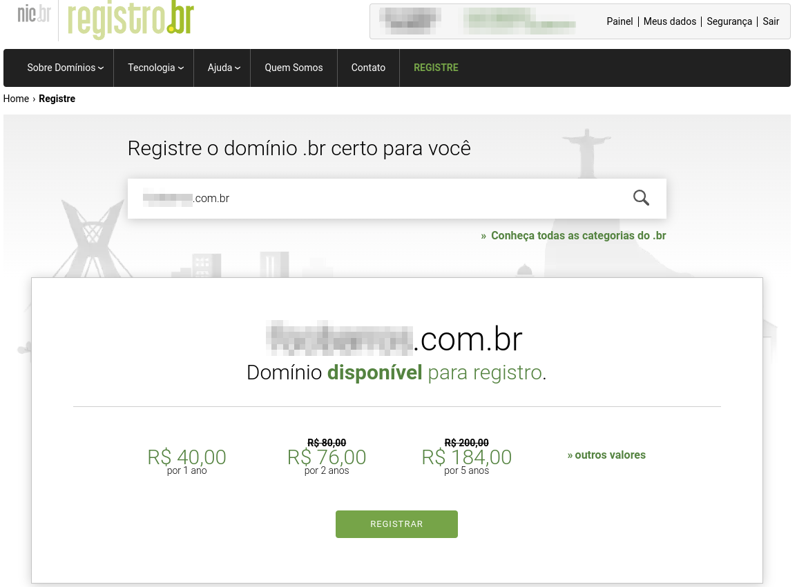
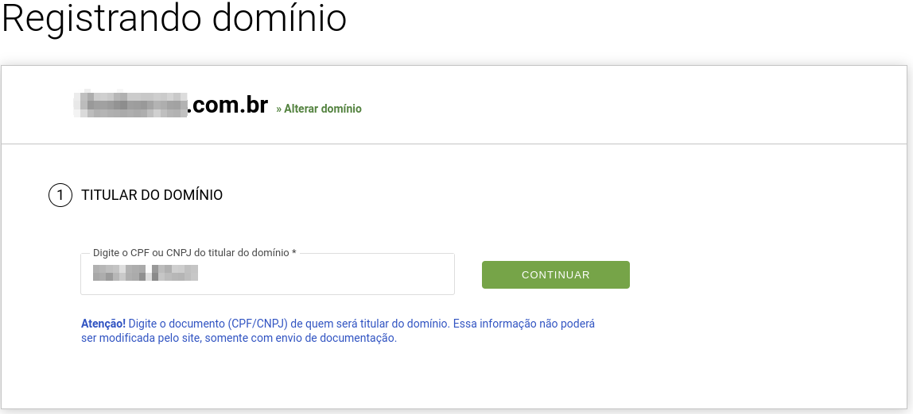
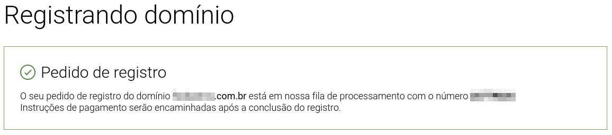
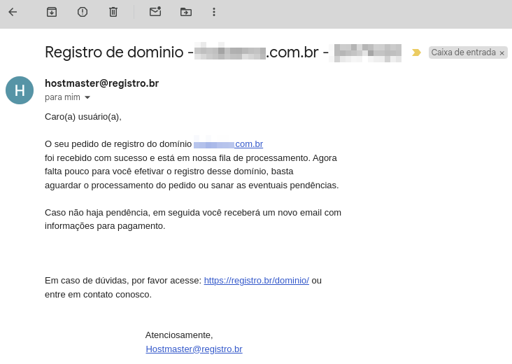
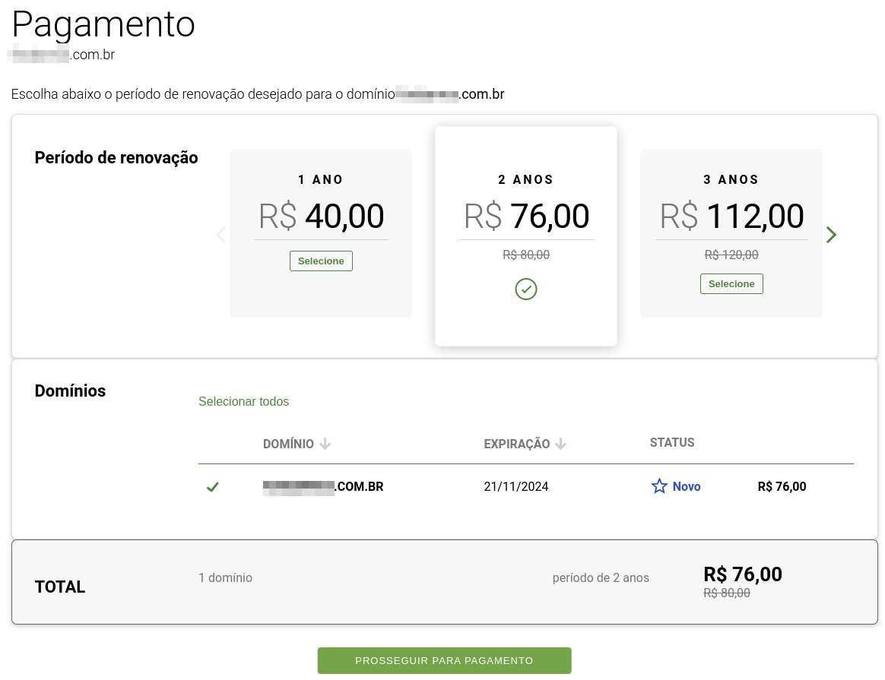

# Registro de dominio

## O que abordaremos?
Registrar um dominio pode ser ua parte interessante deste processo para alguns, então vamos mostrar este passo apenas com a ideia de exemplificar a simplicidade deste processo.

Sei que pode ser uma etapa inutil de ser documentada para algumas pessoas, porém, nem todo mundo já passou ou conhece o processo de registro.

## Onde registrar?
Existem inumeros sites que você pode optar por registrar um dominio, porém, para um site que finalize dom .com.br, do meu 
ponto de vista, o [registro.br](https://registro.br/) permanece sendo a melhor opção, pois são os responsáveis por gerenciar os registros de domínios terminados com **.br**.

Os valores do registro neste site no momento em que escrevo, são de R$ 40,00 por 1 ano podendo registrar por até 10 anos pagando R$ 364,00 (R$ 36,40 por ano).

## Pesquisa e registro
Ao acessar o site, você já encontra a ferramenta de pesquisa de domínio (ao menos atualmente), então veja se o endereço 
que deseja está disponível, caso positivo, clique em 'Registrar'.



Em seguida será necessário informar o CPF/CNPJ do títular do domínio, então inseri meu CPF e na tela seguinte já exibiu 
meus dados (eu já estava logado),  



Ao finalizar, é informado que a solicitação está na fila de processamento, e também é enviado um email que informa que não havendo pendências, receberemos um novo email com instruções de pagamento.





O email seguinte, era justamente com as instruções de pagamento.
```
Caro(a) usuário(a),

O domínio -----.com.br foi cadastrado com sucesso.
Seu domínio entrará em operação na próxima publicação DNS [1].

Efetue o pagamento do serviço acessando o endereço abaixo:

https://registro.br/r/------

Assim que o pagamento for confirmado você receberá um e-mail com a
confirmação de pagamento.

ATENÇÃO: O Registro.br NÃO envia instrumentos de pagamento prontos
para os usuários. Desta forma, NÃO efetue pagamentos de códigos de
barras ou QR code encaminhados por outros meios que não os emitidos em
nosso site. Veja mais em https://registro.br/cobrancas-indevidas/ .

Dados do domínio

Domínio: -----.com.br
Ticket:  -----
Data:    21/11/2024 06:57:34

Titular:
-----
 CPF: -----

O registro de um domínio implica em obrigações que devem ser
respeitadas para que ele funcione de forma correta e segura na
internet. Certifique-se de que as recomendações do item 4.6 do
documento "Práticas de Segurança para Administradores de Redes
Internet" [2] sejam seguidas. Em geral, esta é uma obrigação
compartilhada entre o titular de um domínio e o seu Provedor de
Serviços Internet (provedor de hospedagem).

Em caso de dúvidas, por favor acesse: https://registro.br/dominio ou
entre em contato conosco.

                                        Atenciosamente,
                                        Hostmaster@registro.br
```
Quando cliquei no link, acessei a tela de pagamento, já com a opção de 2 anos selecionada, podendo mudar para 1 até 10 anos como mencionado anteriormente.



Selecionando o período que melhor me atende no momento e seguindo, aparecem as opções de pagamento que são PIX, boleto ou crédito.

O que achei interessante após o pagamento, foi o email que recebi, ele chama de "renovação" e não de "registro".

```
Caro(a) usuário(a),

Conforme sua opção, seguem abaixo os dados referentes à renovação do
seu domínio.

Domínio:    -----.com.br
Criado em:  21/11/2024
Período:    2 ano(s)
Descrição:
 Manutenção de 21/11/2024 a 20/11/2026        R$ 76,00

O pagamento foi executado com cartão de crédito, partindo do endereço
----- em 21/11/2024 07:24:03.

Por favor, aguarde um e-mail de notificação com  a confirmação  de
autorização do pagamento pelo administrador do cartão.

Em caso de dúvidas, leia nossa documentação:
https://registro.br/dominio/
```

Também recebi mais uns 3 emails de confirmação de pagamento e informações sobre como baixar a fatura.

Então é isso. Achou simples? Não tem neste ponto informações relevantes, mas achei importante documentar apenas para se ter uma ideia mesmo de como é feito.