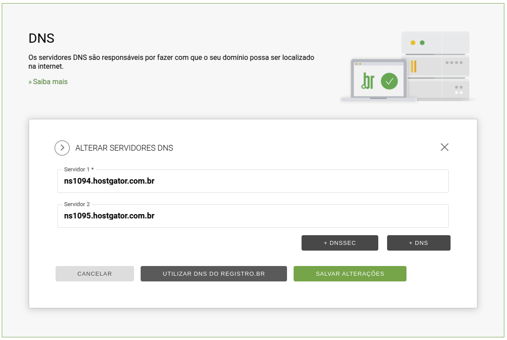
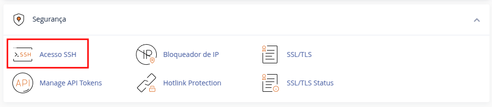
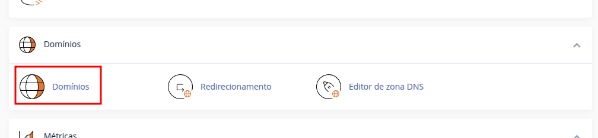
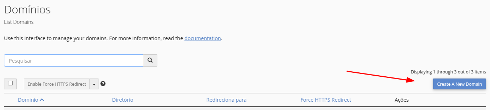
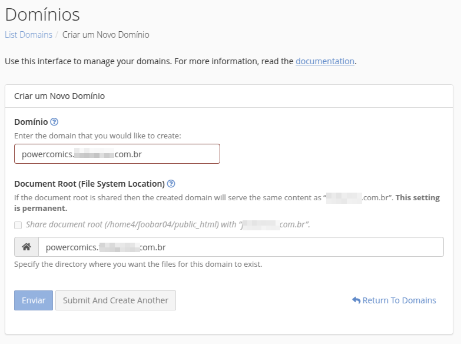
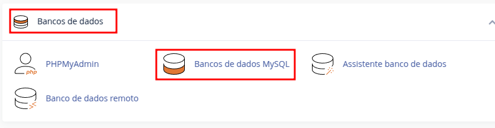
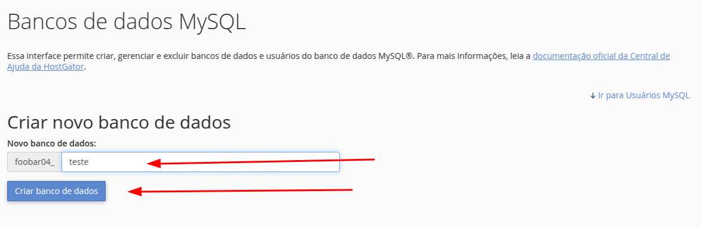
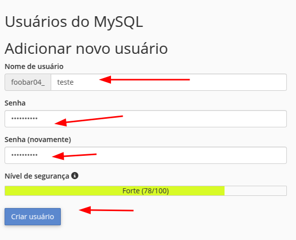
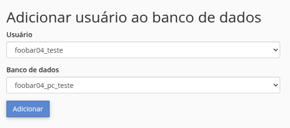
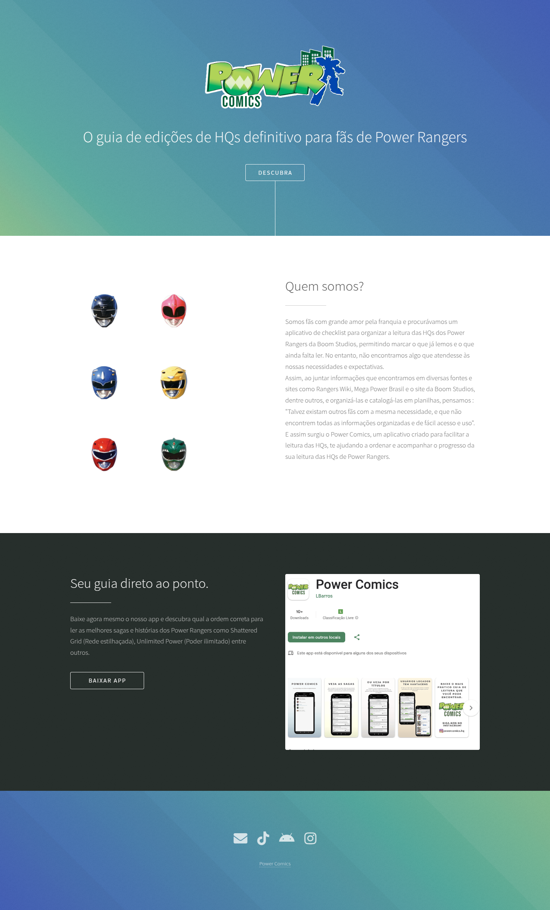

# Hospedagem da API

## O que abordaremos?
Acesso ao servidor para configuração da API e criação de subdominios no cPanel;

## Onde hospedamos?
Temos muitas opções atualmente, com valores e configurações de servidores para todas as necessidades. Pesquisando o aparente
melhor custo/beneficio para o inicio do meu projeto, contratei o "[plano P da Hostgator](https://www.hostgator.com.br/hospedagem-de-sites)", 
onde foi oferecido 100GB de armazenamento SSD, e-mails grátis, transferência de dados ilimitadas e acesso SSH.

## Mão na massa

Primeiro passo foi alterar o servidor DNS no [Registro BR](https://registro.br/painel/dominios/), adicionando os endereços que recebi da Hostgator.



Em seguida, como a propagação da alteração pode levar até 24 horas, vamos configurar o acesso SSH ao servidor.

Ao acessar o cPanel, na parte de segurança encontraremos a opção "Acesso SSH", onde será necessário a criação de uma chave 
para maior segurança no acesso.



Próximo passo foi chamar o suporte da Hostgator no chat, pois toda tentativa de acesso pelo SSH apresentava erro, 
então ao chamar o suporte descobri que eles precisavam habilitar essa função.

Com o SSH habilitado, e pesquisando um pouco na internet[ como acessar o servidor da Hostgator por SSH](https://theandystratton.com/2012/ssh-returns-too-many-authentication-failures-error-hostgator), acabei criando um alias no linux
para não precisar, em todo acesso digitar `alias hostgator='ssh -p2222 -o PubkeyAuthentication=no <usuario>@<ip>`.

Uma observação neste ponto, é que a senha para acesso via SSH é a mesma utilizada para acessar o cPanel.

Então, ao acessar o cPanel, no ítem "Domínios",





Então adicionei o endereço de subdominio, e ao fazer isso, o path do subdominio foi automaticamente definido.



Com o subdominio criado, acessei o servidor via SSH, abri o projeto no caminho que foi definido no passo anterior, então clonei meu projeto do gitlab.
```
[~]# cd powercomics...com.br/
[~/powercomics...com.br]# git clone https://gitlab.com/foobarros/power-comics-api.git
```

Depois de clonar, abri a pasta do projeto, e criei os arquivos .htaccess para que o symfony funcione, seguindo a [orientação de quem já passou por este "problema"](https://pt.stackoverflow.com/questions/506825/publica%C3%A7%C3%A3o-de-aplica%C3%A7%C3%A3o-symfony-produ%C3%A7%C3%A3o) rsrsrsrs.

```
[~/powercomics...com.br]# cd power-comics-api/application/
[~/powercomics...com.br/power-comics-api/application]# vim .htaccess
```

Inserindo o seguinte:
```
RewriteEngine On
RewriteBase /
RewriteCond %{THE_REQUEST} /public/([^\s?]*) [NC]
RewriteRule ^ %1 [L,NE,R=302]
RewriteRule ^((?!public/).*)$ public/$1 [L,NC]
```

E posteriormente...
```
[~/powercomics...com.br/power-comics-api/application]# cd public/
[~/powercomics...com.br/power-comics-api/application/public]# vim .htaccess 
```

Inserindo:
```
RewriteEngine On
RewriteBase /
RewriteCond %{REQUEST_FILENAME} !-f
RewriteCond %{REQUEST_FILENAME} !-d
RewriteRule ^(.*)$ index.php?$1 [L,QSA]
```

Por fim, acessei mais uma vez o cPanel, a parte de gerenciamento de domínio e alterei o path que estava como `powercomics...com.br` para `powercomics...com.br/power-comics-api/application/public`

Para que a aplicação funcione, precisamos do banco de dados, então criei no cPanel em "Banco de dados MySQL"



Criei o banco de dados:



Criei o usuário:



Finalizei vinculando o usuário ao banco:



Atualizei a variável (./.env) de ambiente do banco com as credenciais criadas:
```
DATABASE_URL="mysql://foobar04_teste:<senha>@<ip>:3306/foobar04_pc_teste?charset=utf8mb4"
```

Agora, na raiz do application, fiz um "composer update --no-dev" para instalar as dependências.

E pronto. API estava respondendo, e a home que é apenas uma landing page (ao menos por enquanto) estava acessível.




