# Conta Google Developer 

## O que abordaremos?
Processo de criação de uma conta no [Google Play Console](https://play.google.com/console/u/0/signup) para pessoa física.
## Registro
Estando logado com uma conta google e acessando a página do [Google Play Console](https://play.google.com/console/u/0/signup), como para o meu uso vou criar a conta como hobby, usarei a segunda opção de conta.

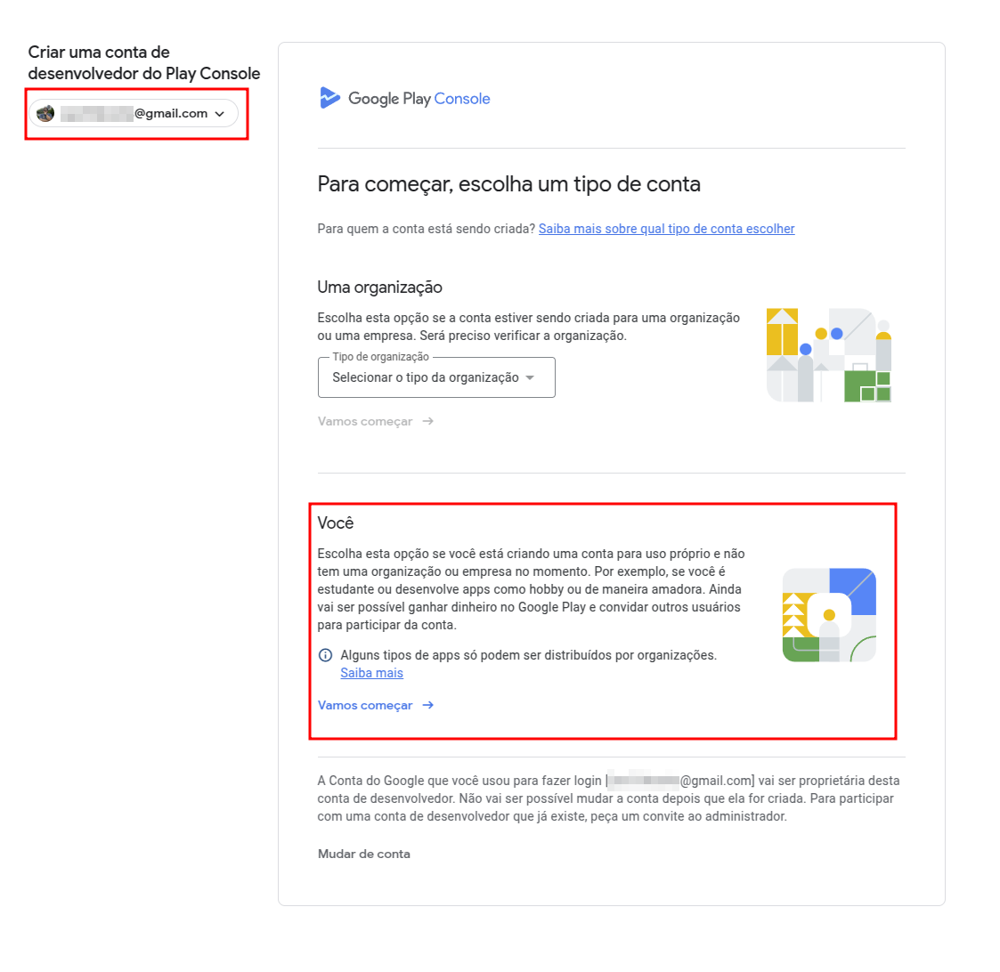

Será apresentada uma tela com instruções/orientações e o valor necessário para criação da conta, que no momento, são de $ 25,00 ([25 dólares](https://wise.com/br/currency-converter/usd-to-brl-rate?amount=25)).

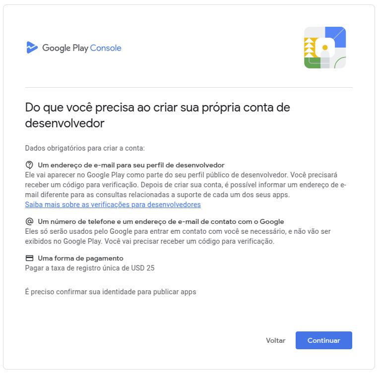

O próximo passo é escolher seu nome de desenvolvedor, então é bom pensar bem em como gostaria de ser apresentado na loja de apps do Google.

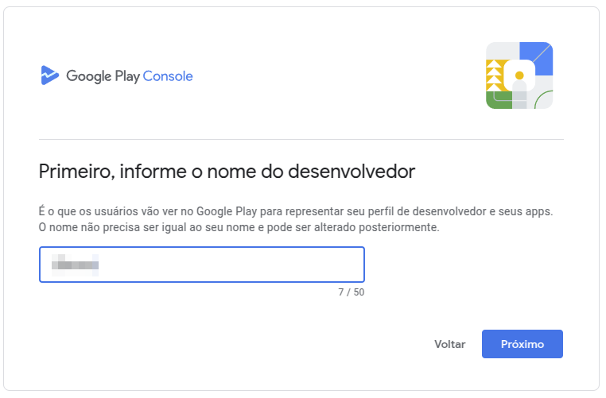

Hora de vincular um "[Perfil de pagamento](https://payments.google.com/gp/w/u/0/home/settings)", que é aquele que vc usa para pagar por apps e etc quando usa o Google. 

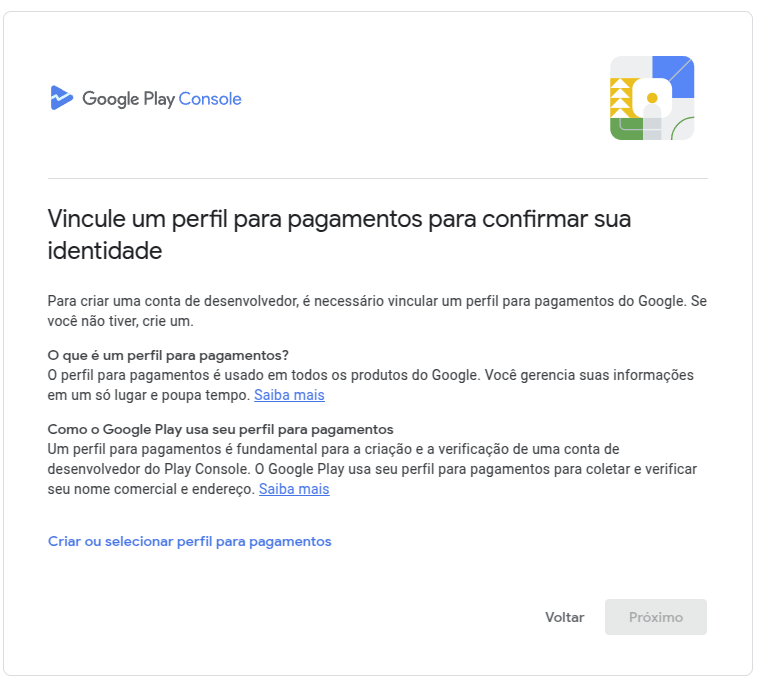

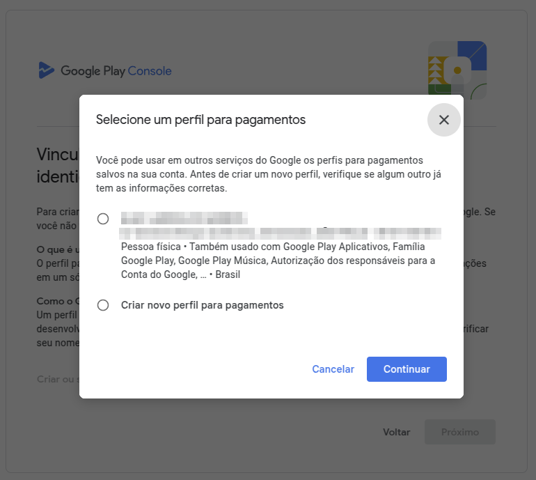

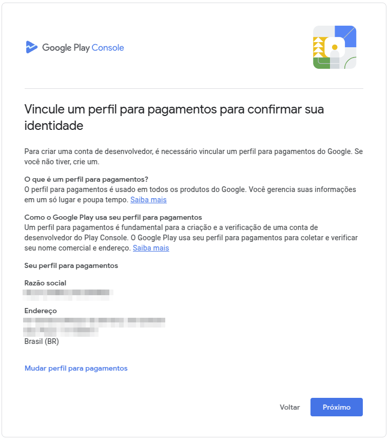

Ao avançar, informações sobre seu perfil publico que serão apresentadas no Google Play são confirmadas. 

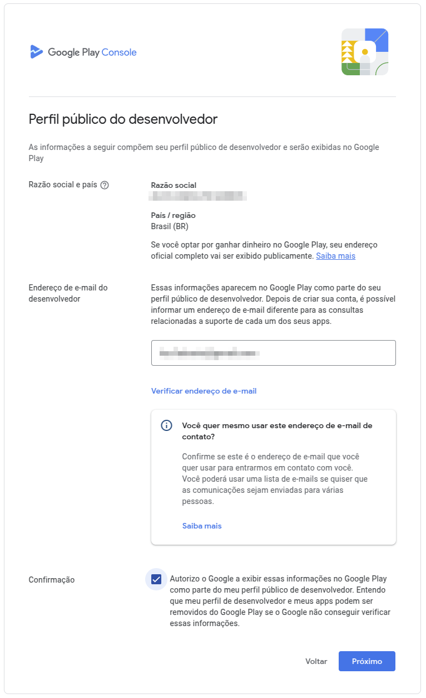

O Google te questionará sobre experiências anteriores com o google play console e com o desenvolvimento de apps.

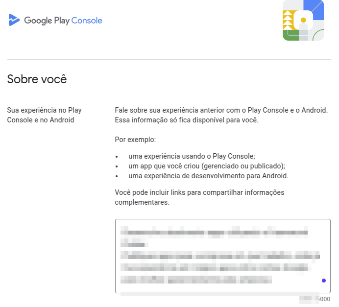

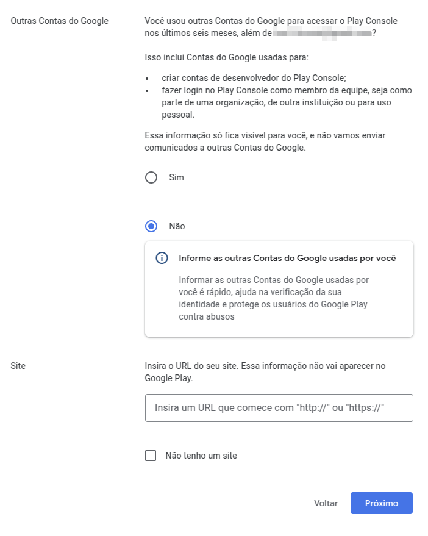

Preencha seu plano de lançamento de apps para os próximos 12 meses.

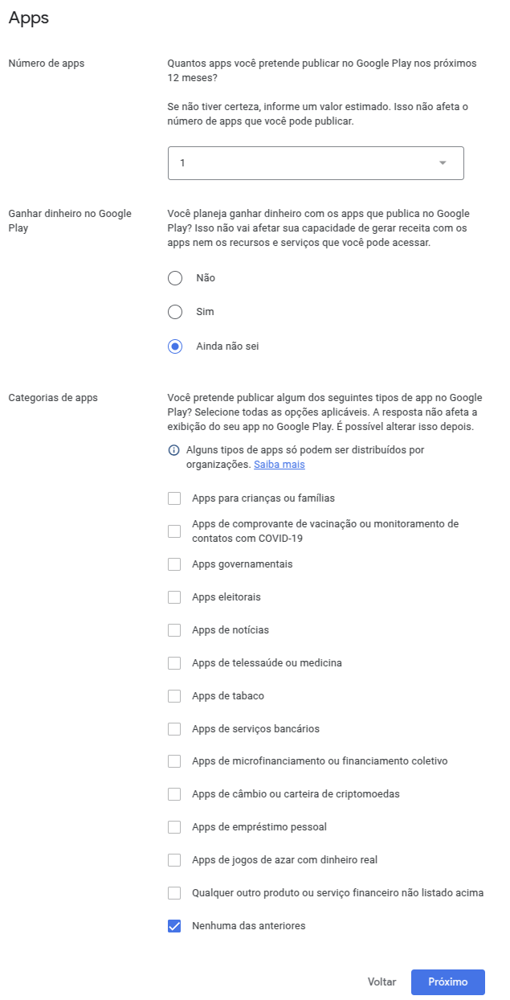

Informe seu e-mail e telefone para que, se necessário, o Google possa entrar em contato. 

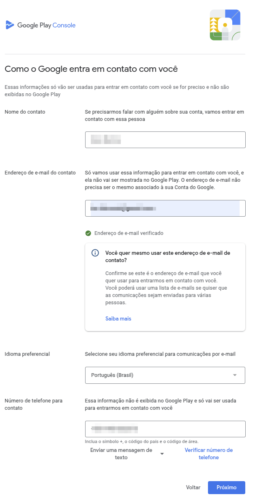

Leia e aceite os contratos (ou resuma usando IA para não ter que ler tudo rsrsrs).

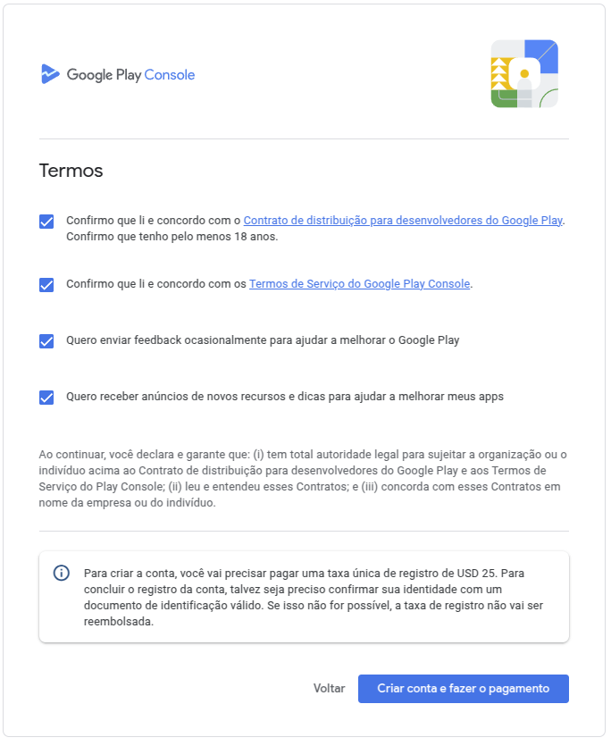

E FINALMENTE, depois de tantos passos, a conta foi criada. Ufa...

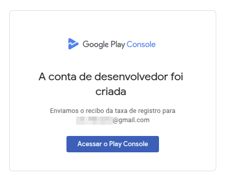

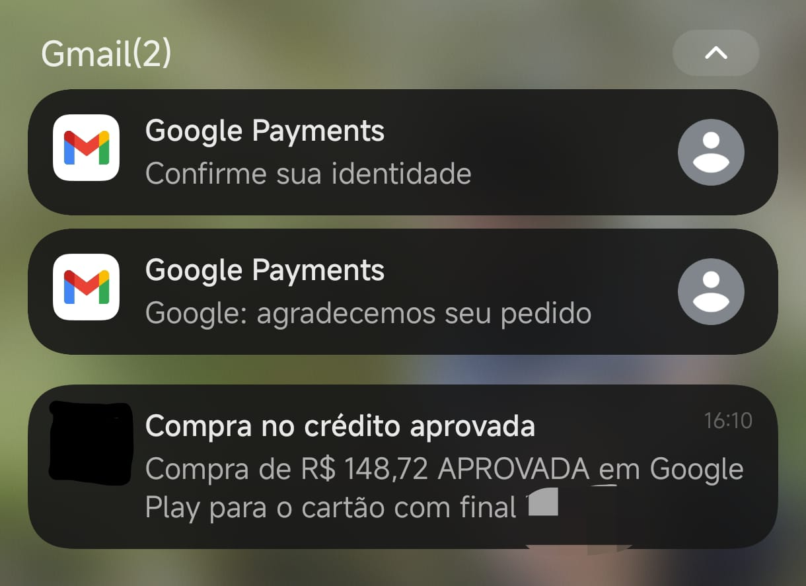

O e-mail de confirmação chegou no dia seguinte (registro feito no domingo e confirmação recebida na segunda).

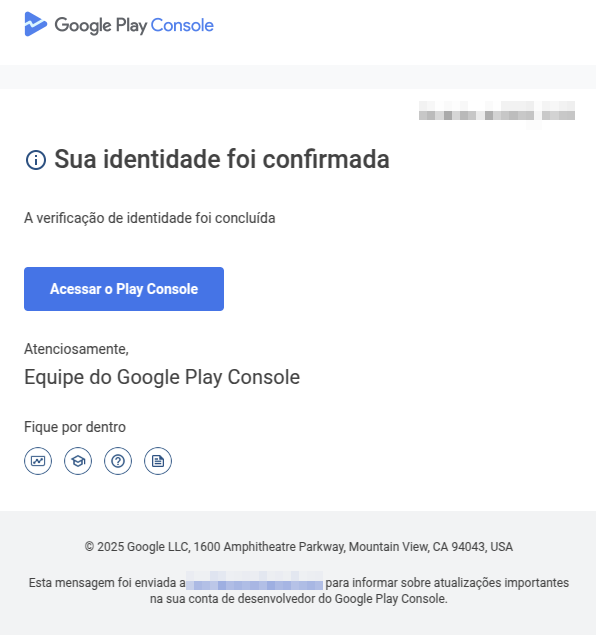