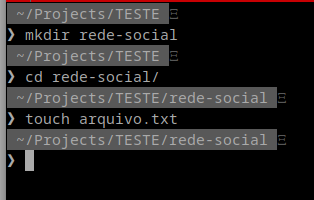
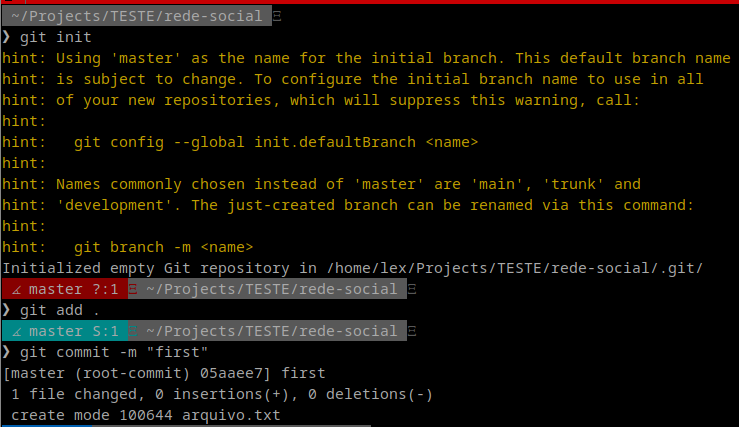
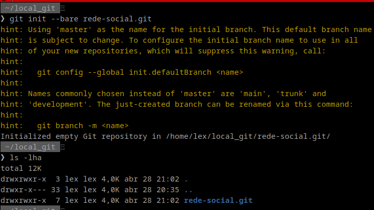
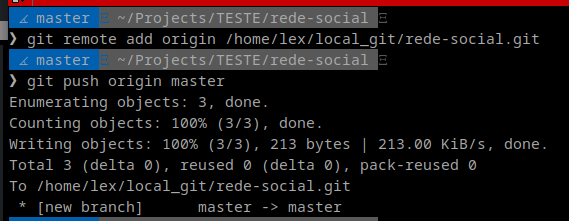
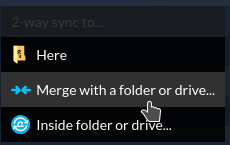
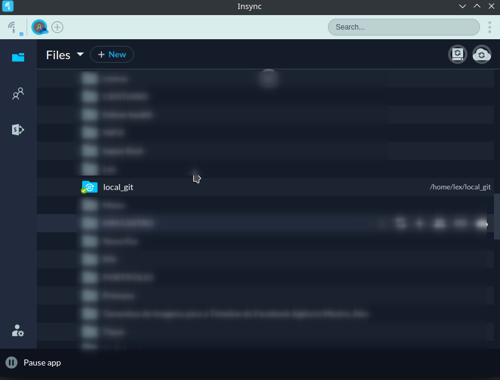

# Como eu estou enviando os commits dos meus projetos para o one drive

### Tópicos
- [Inspiração/motivação ](#motivacao)
- [Criando o projeto ](#criate)
- [Primeiro commit ](#first)
- [Criando repositório destino ](#newRepo)
- [Hora do push ](#push)
- [O céu tá todo azul né? Pq não vi nuvem nenhuma ¬¬ ](#blueSky)
- [Finish him ](#finish)

### Inspiração/motivação 

Algum tempo atrás eu decidi escrever sobre o git-flow e o seu fluxo de trabalho que é muito usado por mim, mesmo após o criador recomendar migrar para o github flow.

Bom, no artigo anterior eu comentei que, caso o desenvolvedor não queira usar o github ou gitlab por exemplo, é possível hospedar os repositórios localmente. Até então, eu não tive necessidade de utilizar o git desta forma, porém, surgiu agora a necessidade e eu vim aqui para falar como estou fazendo.

Pensei nesse artigo mais como um mini tutorial, pois os passos para reproduzir são poucos e simples, então vamos lá?

### Criando o projeto 

Vou iniciar criando um "projeto" chamado "rede-social", e nele terá apenas um arquivo txt para ser comitado, então...

Imagem 01 - Criando o projeto e o primeiro arquivo

### Primeiro commit 

Em seguida, vamos iniciar o git e fazer o primeiro commit.

Imagem 02 - Adicionando as alterações no primeiro commit.

### Criando repositório destino 

Agora que já temos um projeto com commits, chegou a hora de enviar tudo para um repositório, porém, esse repositório ainda não existe.

Chegou a hora de criar o repositório de destino com:

Imagem 03 - Criando repositório de destino.

### Hora do push 

Com o repositório criado, agora é possível "dizer" para o nosso projeto, qual será o repositório remoto dele, atenção para o path do repositório, que é o path completo do repositório que criamos no passo anterior.

vamos já aproveitar também para fazer o push dos commits.

Imagem 04 - Adicionado repositório destino e fazendo o push.

Agora todos os commits do projeto estão salvos em um repositório local.

### O céu tá todo azul né? Pq não vi nuvem nenhuma ¬¬ 

Beleza, isso não podia passar batido. Quando você é um cliente do One Drive, sofre um pouco com uso dele no linux, então eu uso um software chamado [Insync](https://www.insynchq.com).

A parte ruim? Ele é pago, mas quando comprei ele (vários anos atrás), me pareceu a melhor alternativa para uso no linux.

Com o Insync, é possível visualizar todos os arquivos que eu tenho no meu one drive (ou google drive e dropbox, depende da licença adquirida).

Então essa parte vai depender de qual serviço em nuvem você utiliza, e como faria para sincronizar seu repositório local com a nuvem. No meu uso, simplesmente clico com o botão direito na pasta dentro do insync, e coloco para "mergear" com uma pasta minha local.

Imagem 05 - Merge das pastas.

Imagem 06 - Insync.

### Finish him 

É isso, pessoa maravilhosa que dedicou seu tempo para ler o que escrevi. Espero que eu tenha lhe ajudado a entender essa possibilidade que o git nos dá. Obrigado pelo seu tempo e até a próxima.